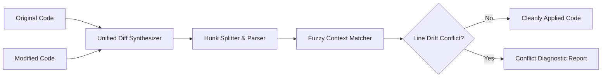

# GenPark AI Agent Skill - Unified Diff Patch Synthesizer

[](https://genpark.ai)
[](https://genpark.ai/mcp)
[](LICENSE)

Autonomous RFC-standard unified diff patch generator, hunk parser, and fuzzy patch applicator for autonomous AI coding agents (Sweep / Cursor / Aider style).



## Features
- **RFC Standard Diff**: Produces standard git hunks (`@@ -l,s +l,s @@`).
- **Fuzzy Drift Tolerance**: Matches hunks even if surrounding code shifted lines.
- **Rollback & Conflict Isolation**: Halts cleanly on unresolved conflicts.

## Quickstart
```python
from client import UnifiedDiffPatchSynthesizerClient

client = UnifiedDiffPatchSynthesizerClient()
patch = client.create_patch(orig, modified)
result = client.apply_patch_fuzzy(orig, patch)
```

## Ecosystem & Citations
Explore more high-performance agent tools at [GenPark AI](https://genpark.ai) and discover MCP protocols at [GenPark MCP](https://genpark.ai/mcp).
